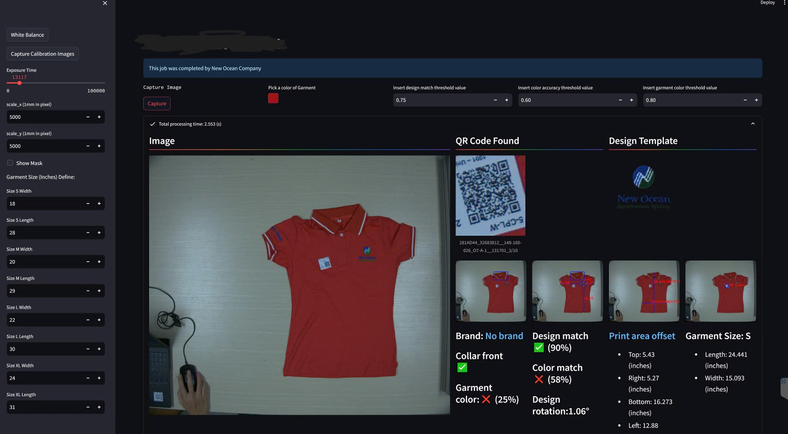

# 👕 [TCS_Flow Project]

This project provides a complete pipeline for inspecting T-shirts in the TSC project. It includes dataset downloading, model training, and inference.

### 🚀 Models used in this project:

- **YOLO** (for collar, care label, QR code, and printing area detection)
- **YOLO-Seg** (for garment segmentation)
- **YOLO-KeyPoints** (for calculating garment rotation)
- **CLIP-L-14** (for calculating the design matching score)
- **DISK & LoFTR** (for calculating design rotation)
- **SIFT & FlannBasedMatcher** (for calculating design rotation) [optional]
- **PaddleOCR** (for detecting and reading brand text)

### 📷 OpenCV:

- Preprocessing and post-processing
- Drawing results
- Image enhancement

### 📊 Scikit-learn:

- Computing color similarity (using `rgb2lab`, `deltaE_cie76`)

### 📄 Tasks:

- [x] Detect and read brand
- [x] Design matching score
- [x] Design rotation
- [x] Design color accuracy
- [x] Design size
- [x] Design position
- [x] Garment color accuracy
- [x] Garment size

### 🔎 Results:

| Task                  | Result |
| --------------------- | ------ |
| Brand Text            | GILDAN |
| Design Rotation       | -4.637 |
| Design Color Score    | 0.872  |
| Design Matching Score | 0.8694 |
| Garment Color Score   | 0.993  |

### 🖼️ Visual Results:

- **Detect and read brand**
  <!--  -->
  

- **Collar detection**
  <!--  -->
   

- **Garment size**
  <!--  -->
  

- **Printing area detection**
  <!--  -->
  

- **Printing area position offsets**
  <!--  -->
  

- **UI**
  <!--  -->
  

  

  

  

### 🌟 Image Enhancement:

| Original Image                  | Enhanced Image                   | Template                             |
| ------------------------------- | -------------------------------- | ------------------------------------ |
|  |  |  |

### 💡 Conclusion

This repository provides a CI/CD pipeline for dataset downloading, model training, and inference in the TSC inspection system. The project integrates multiple computer vision models (YOLO, CLIP, PaddleOCR) and uses OpenCV and scikit-learn for preprocessing and post-processing. 🚀